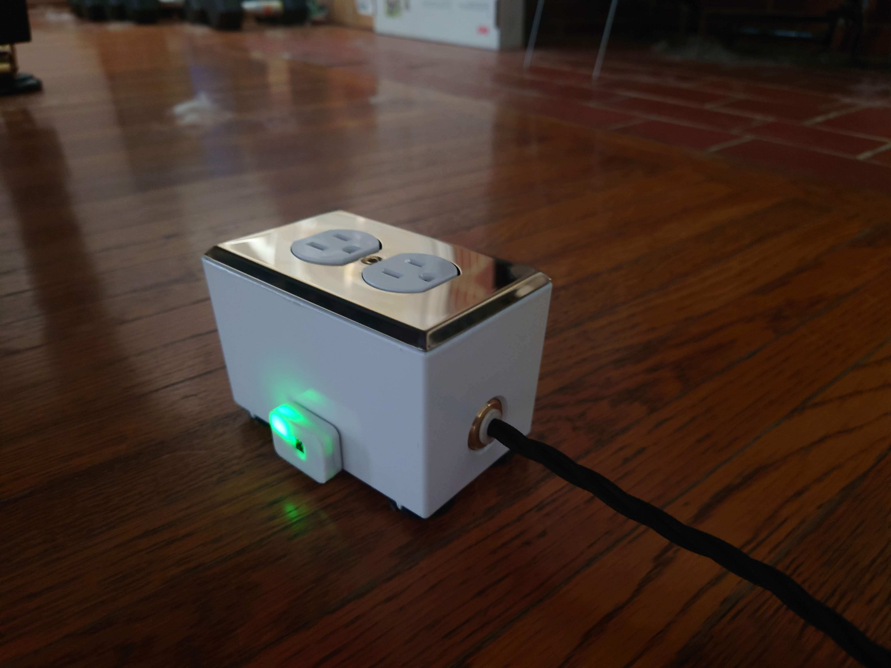

# arduino-projects
Various Arduino projects

## Temp-humidity

### Description
A little tool to keep track of the temperature and humidity in our piano room. The arduino sends Telegram notifications and turns of a switched outlet to turn on a humidifier if it gets too dry in the room.