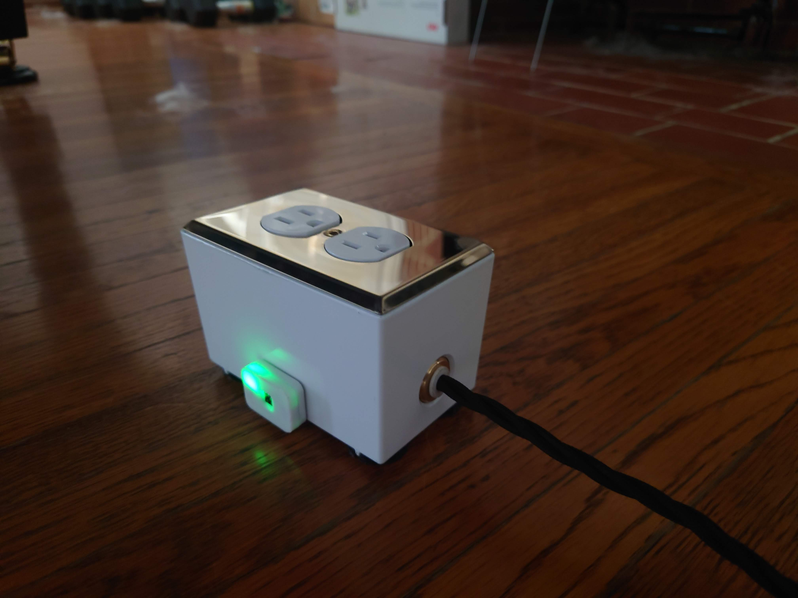

# Temperature-Humidity Control

## Description
A little tool to keep track of the temperature and humidity in our piano room. The arduino sends Telegram notifications and turns of a switched outlet to turn on a humidifier if it gets too dry in the room.

## Arduino Parts Needed
* [SHT40 Temperature & Humidity Sensor](https://www.adafruit.com/product/4885)
* [Adafruit Feather ESP8266](https://www.adafruit.com/product/2821)

## Documentation Used
* [Adafruit IO Basics: Temperature & Humidity](https://learn.adafruit.com/adafruit-io-basics-temperature-and-humidity)
* [UniversalTelegramBot](https://www.arduino.cc/reference/en/libraries/universaltelegrambot/)
* [Coding Timers and Delays in Arduino](https://www.instructables.com/Coding-Timers-and-Delays-in-Arduino/)