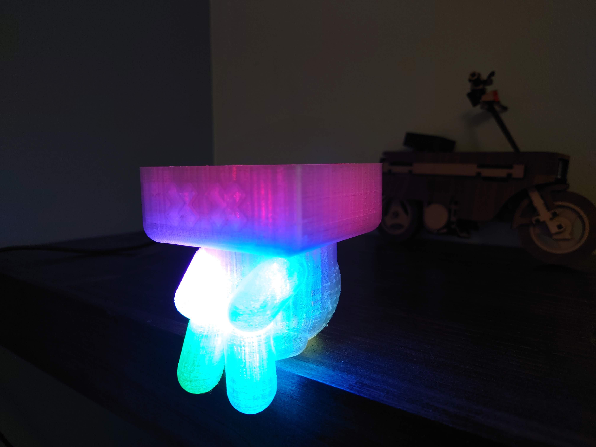

# USB-Switcher

## Description
Control a USB switch using 2 adafruit RF feathers

## Parts needed
* 2x [Adafruit Feather RadioFruit](https://www.adafruit.com/product/3077)
* 6x [Flora RGB NeoPixel](https://www.adafruit.com/product/1260)
* [Adafruit Non-Latching Mini Relay FeatherWing](https://www.adafruit.com/product/2895)
* [NovelKeys Big Switch](https://novelkeys.com/products/the-big-switch-series?_pos=1&_sid=6101be1e1&_ss=r)

## Documentation Used
* [Remote Effects Trigger Box](https://learn.adafruit.com/remote-effects-trigger)

## Libraries Needed
* [RadioHead](https://github.com/adafruit/RadioHead)
* [NeoPixel](https://github.com/adafruit/Adafruit_NeoPixel)

## STL
* [Hollow Big KeyCrappie](https://www.thingiverse.com/thing:4964284)
* [Adafruit Feather Box](http://a360.co/2nK42AQ) - [Documentation](https://learn.adafruit.com/3d-printed-case-for-adafruit-feather/cad)
  * User Parameters changed:
    * caseHeight: 23mm
    * caseMarginSides: 5mm